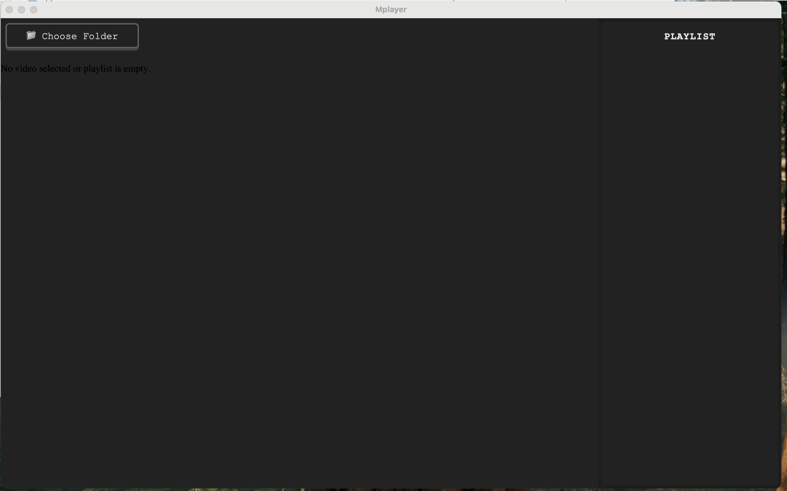

# 🎬 Electron Video Player (Nx + Angular + Electron)

A modern, cross-platform video player built using **Nx**, **Angular**, and **Electron** – designed specifically with **macOS** in mind.

---

## 🚀 Features

- 🎥 Video playback with progress tracking
- 🎛 Keyboard-style controls (play, pause, next, prev, fullscreen)
- 🧠 Playback speed memory
- 📁 Folder picker & playlist generator
- 📦 Built with Nx for modular structure
- 🖥 Packaged as a native macOS Electron app

---

## 🛠 Tech Stack

- [Nx](https://nx.dev/) – Monorepo & build system
- [Angular](https://angular.io/) – Frontend framework
- [Electron](https://www.electronjs.org/) – Desktop application shell
- [TypeScript](https://www.typescriptlang.org/) – Typed JavaScript

---

## 📦 Getting Started

### ▶️ Run Project in Dev Mode

```bash
nx serve
```

This starts both the frontend and the Electron app in development mode with live reload.

---

### 🔧 Build Project

```bash
npm run build
```

This compiles both the Angular frontend and Electron main process into the `dist/` directory.

---

## 🔗 Download Built Version

👉 **[Click here to download the macOS app build](https://github.com/VoropN/video-player/releases/tag/v0.0.0)**

---

## 🎞️ Watch Demo Video

 ****

---

## 📁 Project Structure

```bash
apps/
  frontend/        # Angular UI app
  electron/        # Electron main process
dist/
  frontend/        # Angular build output
  electron/        # Electron packaged output
```

---

## 🧪 Development Tips

- Modify `apps/frontend/src` for UI changes
- Modify `apps/electron/main.ts` for Electron logic
- Rebuild with `npm run build` to reflect updates

---
